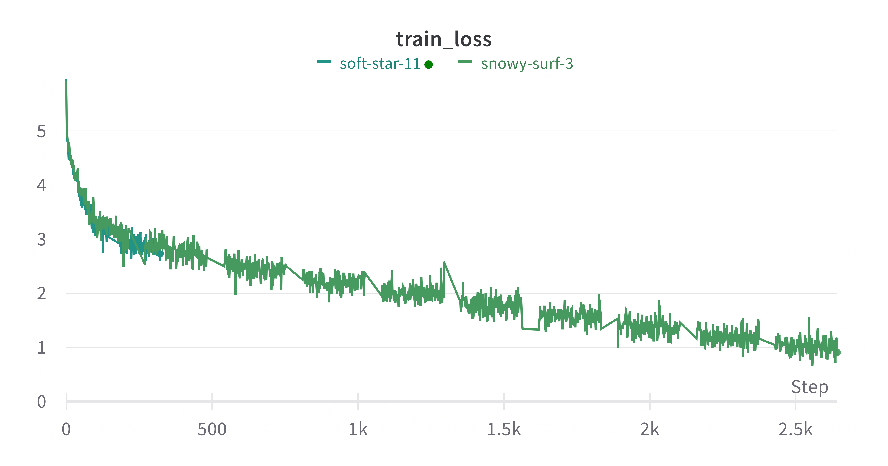
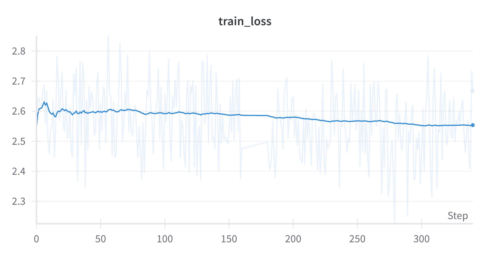
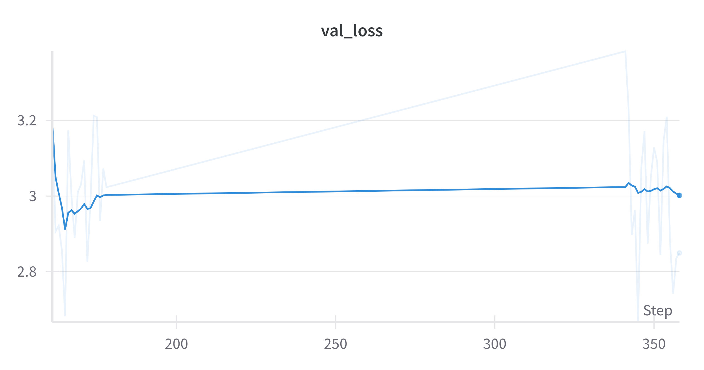

# buddE
My own implementation of object detection using DeiT Encoder and trained Decoder (as proposed in Pix2Seq).

This version does not predict pixel values as text. Instead, bounding boxes are reshaped to match the image patches in the Encoder. Each token represents a location in the image, there are:

num_tokens = (image_size / patch_size)**2

The prediction task is then defined as predicting the patch (token) of the upper left and lower right corner of the bbox.

## 19.11.2023
Training pipeline works. mAP score still below expectation. Definitely overfitting.

#### Next steps: 
Investigate into randomizing object order in tokenizer. 

## 23.11.2023 
- randomized object order in tokenizer does not improve map
- added learning rate warmup.
- added resume_training() function to resume training from checkpoint.
- added torchmetric: metric.reset() to avoid memory bleed (training stopped by Linux OOM-Killer after ~10 epochs.)
- resumed training, at epoch 16, with lr warmup (oops), results indicate overfiting.

#### Next steps:
- top-k sampling from predicted tokens? we get too many class indices, this should be learnable.
- re-run training from start with lr_warmup.

Based on: 
@software{Shariatnia_Pix2Seq-pytorch_2022,
author = {Shariatnia, M. Moein},
doi = {10.5281/zenodo.7010778},
month = {8},
title = {{Pix2Seq-pytorch}},
version = {1.0.0},
year = {2022}
}

And the awesome tutorial (link below), thank you so much Moein Shariatnia:
https://pub.towardsai.net/easy-object-detection-with-transformers-simple-implementation-of-pix2seq-model-in-pytorch-fde3e7162ce7