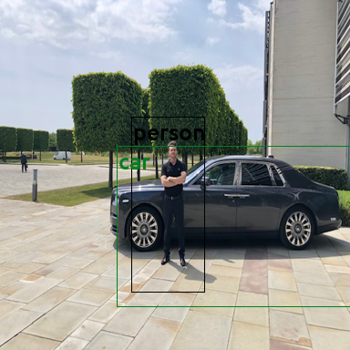
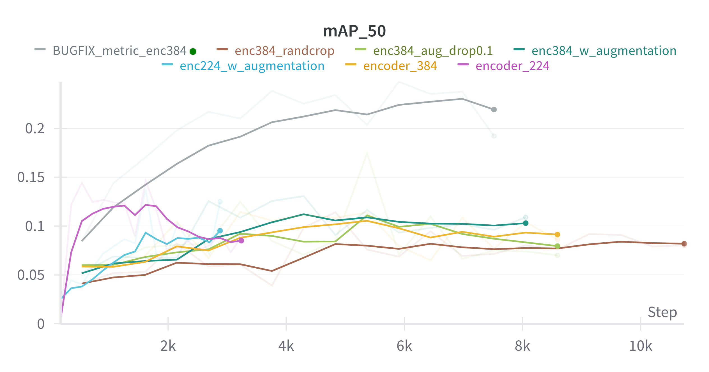
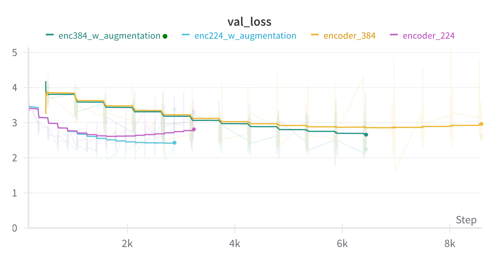
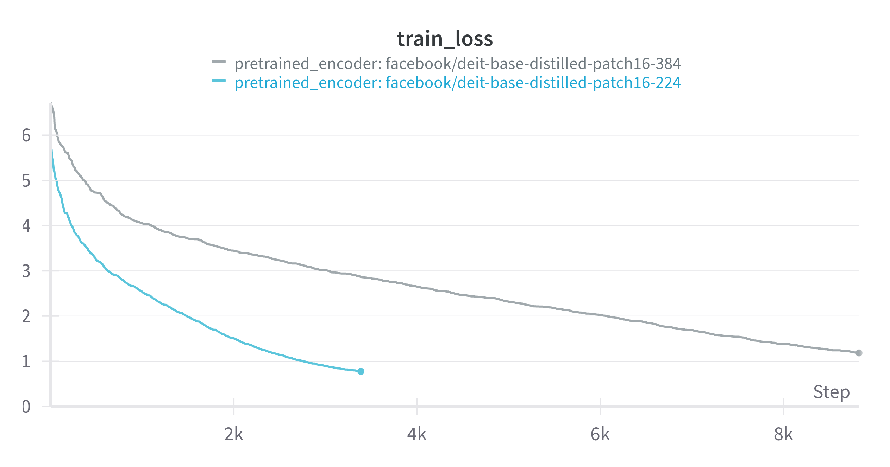
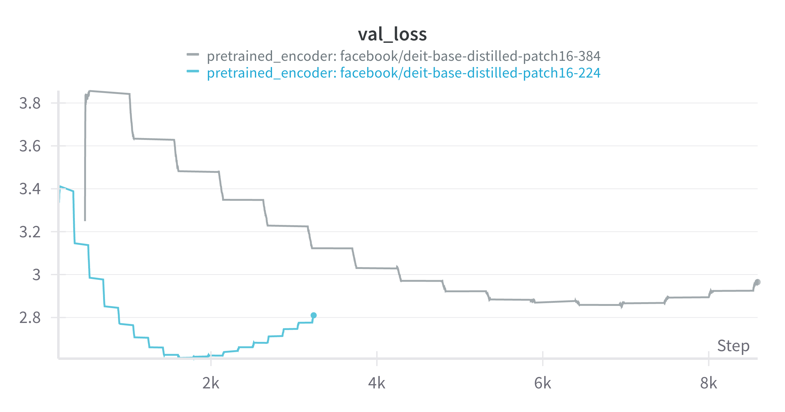
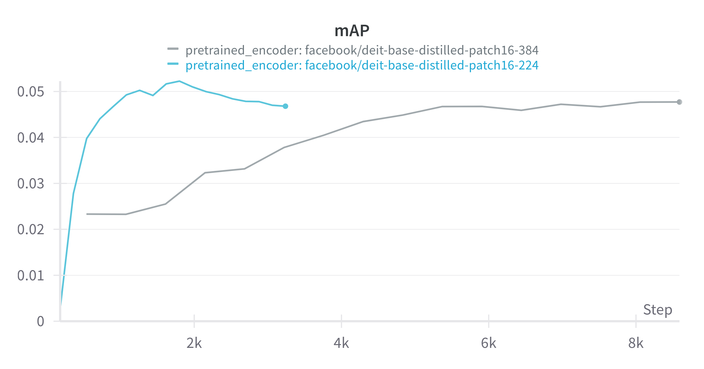

# buddE
My own implementation of object detection using DeiT Encoder and trained Decoder (as proposed in Pix2Seq).
Train / Val set is PASCAL VOC.

This version does not predict pixel values as text. Instead, bounding boxes are reshaped to match the image patches in the Encoder. Each token represents a location in the image, there are:

num_tokens = (image_size / patch_size)**2

The prediction task is then defined as predicting the patch (token) of the upper left and lower right corner of the bbox.

## 15.12.2023
- Training 384-image-size model with no bottleneck (hidden dim 768) and frozen pretrained encoder fits the data a lot quicker.
<iframe src="https://wandb.ai/yeswegan/object-detection-transformer?workspace=user-yeswegan" style="border:none;height:1024px;width:100%">

## 12.12.2023
- trained 224-image-size model on COCO using bottleneck dim of 512 (was 256), converged after roughly 50 epochs, giving performance increase especially in small / medium boxes. Maybe those small features are lost in the bottleneck
- next step: do not use a bottleneck, freeze pretrained encoder layers

 'map': tensor(0.2030), 
 'map_50': tensor(0.3037), 
 'map_75': tensor(0.2093), 
 'map_large': tensor(0.3940), 
 'map_medium': tensor(0.1639), 
 'map_small': tensor(0.0422), 
 'mar_1': tensor(0.2232), 
 'mar_10': tensor(0.2932), 
 'mar_100': tensor(0.2971), 
 'mar_large': tensor(0.4866), 
 'mar_medium': tensor(0.2567), 
 'mar_small': tensor(0.0693) 

## 10.12.2023
- model converged on COCO after 48 epochs, taking 38 hours of training, see wandb [coco_train_run](https://wandb.ai/yeswegan/object-detection-transformer/runs/ck3sb828/workspace?workspace=user-yeswegan)
- again, performance on larger objects is decent, while smaller objects (knife, fork, spoon, banana,..) are detected disproportionally bad. Could be that my tokenization step filters out inherently small classes.
- here are the metrics for COCO val set: 

 'map': tensor(0.1854),  
 'map_50': tensor(0.2879), 
 'map_75': tensor(0.1914), 
 'map_large': tensor(0.3375), 
 'map_medium': tensor(0.0964), 
 'map_small': tensor(0.0261), 
 'mar_1': tensor(0.2150), 
 'mar_10': tensor(0.2775), 
 'mar_100': tensor(0.2797), 

### Next steps:
- retrain model, using only 80 classes (used 91 for this one - 11 classes unused, maybe consuming model capacity?)
- 

## 07.12.2023
- adjusted dataset class for use with MS COCO
- adjusted train loop for resuming runs with wandb logging
- start training run with MS COCO, total estimated traintime: 20h
- switched to ruff for code linting

## 04.12.2023
- added inference for unknown images, see below image!
- added Hue/Sat augmentation, increased p-vals for augmentations and restart training

## 30.11.2023
- added predict function for token generation
- utilizes recycling of encoded x (image) for fast inference
- here are the metrics for the validation set (10% of PASCAL VOC), mAP@IoU.50 0.34:

 'map': tensor(0.1914),  
 'map_50': tensor(0.3401), 
 'map_75': tensor(0.1849), 
 'map_large': tensor(0.2639), 
 'map_medium': tensor(0.0071), 
 'map_small': tensor(0.), 
 'mar_1': tensor(0.2492), 
 'mar_10': tensor(0.2685), 
 'mar_100': tensor(0.2685), 

Poor performance in small bboxes probably due to the patchwise tokenization (minimum bbox size is 4 patches - 32*32 pixels). 
Note: mAP calculated using also patchwise bounding boxes as ground truth (x / y dimensions are multiples of 16)

Next steps:
- calculate mAP with original ground truth

## 29.11.2023
FINALLY! Found the bug that kept my mAP metric down (softmax/argmax along wrong dim).
- mAP negatively correlates with val_loss now
- mAP@IoU.50 0.24

Next Steps:
- add predict method for unknown images
- scale up with MS COCO

## 28.11.2023
- added augmentations for training
- overfitting delayed 1-2 epochs

## 26.11.2023
- adjusted positional encodings: scaled by math.sqrt(embedding_dim)
- toml config replaced with Config class
- closed two issues

### Results:
- Overfitting relatively early (7-9 epochs), need albumentation transforms
- mAP still relatively low, should include proper prediction pipeline

## 23.11.2023
- re-train with warmup shows no signs of overfitting for 20 epochs, great
- investigation into poor mAP reveals some images have 99 predictions (max possible given max_seq_len=300)
- introduce probs for validation: torch.nn.functional.softmax passed to metric

## 21.11.2023 
- randomized object order in tokenizer does not improve map
- added learning rate warmup.
- added resume_training() function to resume training from checkpoint.
- added torchmetric: metric.reset() to avoid memory bleed (training stopped by Linux OOM-Killer after ~10 epochs.)
- resumed training, at epoch 16, with lr warmup (oops), results indicate overfiting.

#### Next steps:
- top-k sampling from predicted tokens? we get too many class indices, this should be learnable.
- re-run training from start with lr_warmup.

## 19.11.2023
Training pipeline works. mAP score still below expectation. Definitely overfitting.

#### Next steps: 
Investigate into randomizing object order in tokenizer. 

Based on: 
@software{Shariatnia_Pix2Seq-pytorch_2022,
author = {Shariatnia, M. Moein},
doi = {10.5281/zenodo.7010778},
month = {8},
title = {{Pix2Seq-pytorch}},
version = {1.0.0},
year = {2022}
}

And the awesome tutorial (link below), thank you so much Moein Shariatnia:
https://pub.towardsai.net/easy-object-detection-with-transformers-simple-implementation-of-pix2seq-model-in-pytorch-fde3e7162ce7